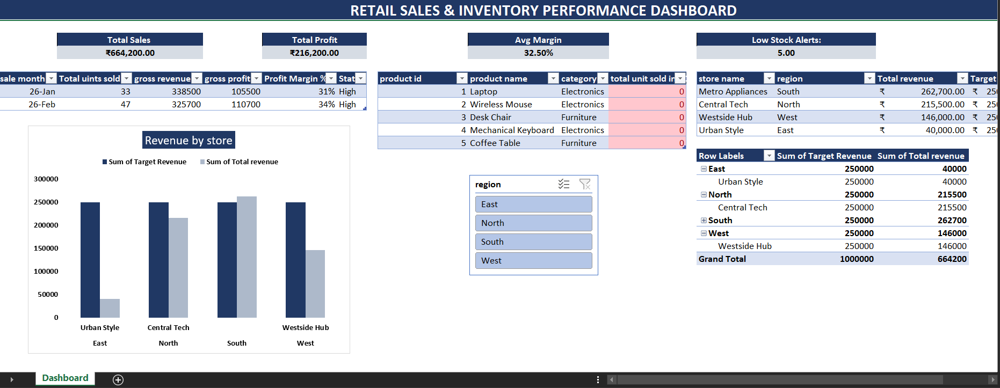

# Retail Sales & Inventory Performance Dashboard

## Project Overview
An integrated retail analytics project designed to track monthly revenue against targets, monitor store-level margins, and highlight real-time stock alerts to support inventory planning.

## Business Problem Addressed
- **Target vs. Actual Tracking:** Evaluating sales performance across store locations (`Metro Appliances`, `Central Tech`, `Westside Hub`, `Urban Style`).
- **Inventory Management:** Identifying zero-stock product lines to prevent stockouts and supply chain delays.
- **Profitability Analysis:** Monitoring gross profit percentages and average margins across product categories (`Electronics`, `Furniture`).

## Tech Stack & Features
- **SQL:** Extracted, joined, and aggregated raw transactional tables using `GROUP BY`, `JOIN`, and aggregate logic.
- **Excel Analytics:** Used Pivot Tables, `SUMIFS`, conditional logic, dynamic KPIs (`Total Sales`, `Total Profit`, `Avg Margin`, `Low Stock Alerts`), and dynamic `Region` slicers.
- **Visual Design:** Structured card layout with visual conditional formatting alerts for zero-inventory items.

## Dashboard Preview

## Key Insights & Findings
1. **Top Performing Store:** Metro Appliances (South region) achieved the highest total revenue at **₹2,62,700**, exceeding its target of ₹2,50,000.
2. **Underperforming Store:** Urban Style (East region) generated **₹40,000** against a ₹2,50,000 target, requiring targeted marketing support.
3. **Inventory Risk:** Core products including Laptops, Wireless Mice, and Mechanical Keyboards hit zero stock levels, triggering immediate reorder flags.

## How to View
1. Open `dashboard_preview.png` for a direct visual preview.
2. Download `Monthly_Sales_Data.xlsx` to test interactive slicers and pivot views.
3. Review the `.sql` script file for the underlying data extraction queries.
